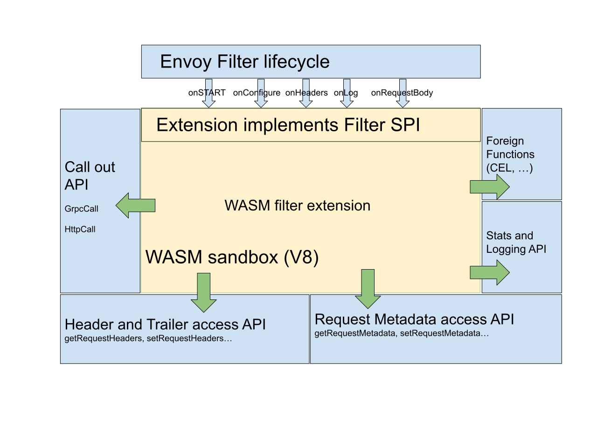
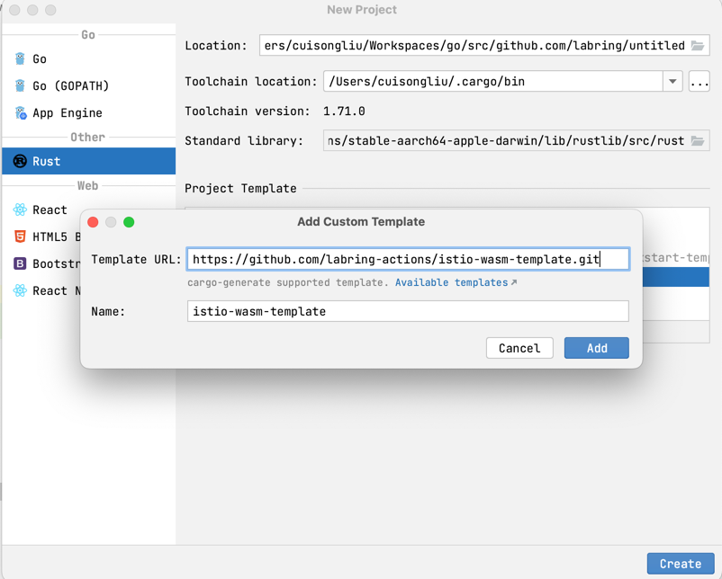

# Istio与WebAssembly

Istio引入了WebAssembly扩展的概念，允许开发者通过将自定义的WebAssembly模块插入Istio的Envoy代理来扩展Istio的功能。这为Istio带来了更高的灵活性和可扩展性，开发者可以在不改变Istio核心代码的情况下添加自定义功能。

## WebAssembly在Istio中的工作原理

WebAssembly 是一种沙盒技术，可以用于扩展 Istio 代理（Envoy）的能力。 Proxy-Wasm 沙盒 API 取代了 Mixer 作为 Istio 主要的扩展机制。

WebAssembly 沙盒的目标：

- 效率 - 这是一种低延迟，低 CPU 和内存开销的扩展机制。
- 功能 - 这是一种可以执行策略，收集遥测数据和执行有效荷载变更的扩展机制。
- 隔离 - 一个插件中程序的错误或是崩溃不会影响其它插件。
- 配置 - 插件使用与其它 Istio API 一致的 API 进行配置。可以动态的配置扩展。
- 运维 - 扩展可以以仅日志，故障打开或者故障关闭的方式进行访问和部署。
- 扩展开发者 - 可以用多种编程语言编写。

### 高级架构

Istio 扩展（Proxy-Wasm 插件）有几个组成部分：

- 过滤器服务提供方接口（SPI） 用于为过滤器构建 Proxy-Wasm 插件。
- 沙盒 在 Envoy 中嵌入 V8 Wasm 运行时。
- 主机 API 用于处理请求头，尾和元数据。
- 调出 API 针对 gRPC 和 HTTP 请求。
- 统计和记录 API 用于度量统计和监控。



### 应用场景

- 自定义流量管理：开发者可以使用WebAssembly模块实现自定义的流量控制策略，如AB测试、灰度发布等。
- 安全策略：通过WebAssembly模块，可以实现自定义的安全策略，例如访问控制、防火墙规则等。
- 日志和监控：开发者可以使用WebAssembly模块来收集特定流量的指标或日志。

## ABI 规范定义 (Application Binary Interface)

应用程序二进制接口（ABI）规范定义了L4/L7代理与作为WebAssembly模块交付的扩展之间使用的约定。这些规范最初为Envoy项目中的WebAssembly开发而创建，但在代理无关，使用者可以在不同的代理之间使用相同的Proxy-Wasm扩展。

### SDKs

Istio提供了多种WebAssembly SDK，方便开发者使用不同编程语言编写插件：

- [C++ SDK](https://github.com/proxy-wasm/proxy-wasm-cpp-sdk)
- [Rust SDK](https://github.com/proxy-wasm/proxy-wasm-rust-sdk)
- [AssemblyScript SDK](https://github.com/solo-io/proxy-runtime)
- [TinyGo SDK](https://github.com/tetratelabs/proxy-wasm-go-sdk)

## Istio Wasm Plugin 介绍

[Istio Wasm Plugin](https://istio.io/latest/zh/docs/reference/config/proxy_extensions/wasm-plugin/)是一种通过WebAssembly过滤器来扩展Istio代理功能的机制。通过设置插件的阶段（phase）和优先级（priority），可以在用户提供的Wasm插件和Istio内部过滤器之间配置复杂的交互。

以下是一些使用示例：

1. 使用本地文件读取wasm插件：

```yaml
apiVersion: extensions.istio.io/v1alpha1
kind: WasmPlugin
metadata:
  name: openid-connect
  namespace: istio-ingress
spec:
  selector:
    matchLabels:
      istio: ingressgateway
  url: file:///opt/filters/openid.wasm
  sha256: 1ef0c9a92b0420cf25f7fe5d481b231464bc88f486ca3b9c83ed5cc21d2f6210
  phase: AUTHN
  pluginConfig:
    openid_server: authn
    openid_realm: ingress
```

2. 使用OCI镜像读取wasm插件并设置拉取的secret：

```yaml
apiVersion: extensions.istio.io/v1alpha1
kind: WasmPlugin
metadata:
  name: openid-connect
  namespace: istio-ingress
spec:
  selector:
    matchLabels:
      istio: ingressgateway
  url: oci://private-registry:5000/openid-connect/openid:latest
  imagePullPolicy: IfNotPresent
  imagePullSecret: private-registry-pull-secret
  phase: AUTHN
  pluginConfig:
    openid_server: authn
    openid_realm: ingress
```

3. 使用环境变量读取变量：

```yaml
apiVersion: extensions.istio.io/v1alpha1
kind: WasmPlugin
metadata:
  name: openid-connect
  namespace: istio-ingress
spec:
  selector:
    matchLabels:
      istio: ingressgateway
  url: oci://private-registry:5000/openid-connect/openid:latest
  imagePullPolicy: IfNotPresent
  imagePullSecret: private-registry-pull-secret
  phase: AUTHN
  pluginConfig:
    openid_server: authn
    openid_realm: ingress
  vmConfig:
    env:
    - name: POD_NAME
      valueFrom: HOST
    - name: TRUST_DOMAIN
      value: "cluster.local"
```

4. 使用http读取wasm插件：

```yaml
apiVersion: extensions.istio.io/v1alpha1
kind: WasmPlugin
metadata:
  name: openid-connect
  namespace: istio-ingress
spec:
  selector:
    matchLabels:
      istio: ingressgateway
  url: https://private-bucket/filters/openid.wasm
  imagePullPolicy: Always
  phase: AUTHN
  pluginConfig:
    openid_server: authn
    openid_realm: ingress
  vmConfig:
    env:
    - name: POD_NAME
      valueFrom: HOST
    - name: TRUST_DOMAIN
      value: "cluster.local"
```

## Wasm Plugin 与 Istio执行顺序

Wasm插件的执行顺序由阶段（phase）和优先级（priority）设置决定。在Istio代理收到请求时，根据Wasm插件的设置，将它们按照阶段进行分组，并在每个阶段内按优先级值进行排序。然后，Istio代理按照阶段和优先级的顺序依次调用每个Wasm插件的逻辑，从而实现个性化处理和功能扩展。

```mermaid
sequenceDiagram
   participant gateway
   participant istio.authn
   participant istio.authz
   participant istio.stats
   participant router
   gateway->>istio.authn: AUTHN wasm plugins
   istio.authn->>istio.authz: AUTHZ wasm plugins
   istio.authz->>istio.stats: STATS wasm plugins
   istio.stats->>router: UNSPECIFIED_PHASE wasm plugins
```

### WasmPlugin 支持字段

`WasmPlugins`提供了一种通过WebAssembly过滤器扩展Istio代理功能的机制。以下是`WasmPlugins`支持的字段以及它们的描述：

- `selector`: 用于选择将应用该插件配置的特定pod/虚拟机集合的条件。
- `url`: Wasm模块或OCI容器的URL。支持file://，oci://和http[s]://等协议。
- `sha256`: SHA256校验和，用于验证Wasm模块或OCI容器。
- `imagePullPolicy`: 在通过OCI镜像或http/https获取Wasm模块时应用的拉取行为。
- `imagePullSecret`: 用于OCI镜像拉取的凭据。
- `pluginConfig`: 传递给插件的配置信息。
- `pluginName`: 在Envoy配置中使用的插件名称。
- `phase`: 确定将WasmPlugin插入过滤器链的位置。
- `priority`: 确定在同一阶段中多个WasmPlugin的执行顺序。
- `vmConfig`: 配置Wasm虚拟机（VM）的信息。
- `match`: 用于指定哪些流量将传递给WasmPlugin的条件。

## 环境准备

```shell
wget https://github.com/labring/sealos/releases/download/v4.3.0/sealos_4.3.0_linux_amd64.tar.gz
tar -zxvf sealos_4.3.0_linux_amd64.tar.gz sealos
chmod a+x sealos 
mv sealos /usr/bin/
sealos run labring/kubernetes-docker:v1.23.0 labring/helm:v3.12.0 labring/calico:v3.24.1
```

### 部署 Istio

```shell
sealos run labring/istio:1.16.2-min
```

### 安装rust语言环境

```shell
curl --proto '=https' --tlsv1.2 -sSf https://sh.rustup.rs | sh
```

> 如果使用的国内环境，可以使用以下命令操作

```shell
export RUSTUP_DIST_SERVER="https://rsproxy.cn"
export RUSTUP_UPDATE_ROOT="https://rsproxy.cn/rustup"
curl --proto '=https' --tlsv1.2 -sSf https://rsproxy.cn/rustup-init.sh | sh
cat > ~/.cargo/config <<EOF
[source.crates-io]
replace-with = 'rsproxy-sparse'
[source.rsproxy]
registry = "https://rsproxy.cn/crates.io-index"
[source.rsproxy-sparse]
registry = "sparse+https://rsproxy.cn/index/"
[registries.rsproxy]
index = "https://rsproxy.cn/crates.io-index"
[net]
git-fetch-with-cli = true
EOF
```

### 初始化 rust wasm 项目

#### 使用 JetBrains 插件

打开Goland 并安装插件 Rust后创建项目

1. 新增配置istio-wasm-rust模板: 
> 填写模板地址: https://github.com/labring-actions/istio-wasm-template.git


2. 新建项目选择istio-wasm-rust模板


#### 使用命令行

```shell
cargo install cargo-generate
cargo generate --git https://github.com/labring-actions/istio-wasm-template.git --name my-project
cd my-project
```

### 编译

本地编译：

```shell
make build 
```

容器编译：

```shell
REPO=sealos.hub:5000 IMG=wasm/wasm-auth:latest make docker-build
```

### 部署

#### 本地编译后部署

```shell
sealos login sealos.hub:5000
REPO=sealos.hub:5000 IMG=wasm/wasm-auth:v1 make oci-build
REPO=sealos.hub:5000 IMG=wasm/wasm-auth:latest make sealos-push
sealos run sealos.hub:5000/wasm/wasm-auth:latest
```

#### 容器编译后部署

```shell
REPO=sealos.hub:5000 IMG=wasm/wasm-auth:latest make sealos-push
sealos run sealos.hub:5000/wasm/wasm-auth:latest
```

### 验证部署

```text
kubectl get pod -n istio-system
NAME                                    READY   STATUS    RESTARTS   AGE
istio-ingressgateway-556959fc6f-prbbg   1/1     Running   0          4d15h
istiod-5b9c4f9bf9-w6xns                 1/1     Running   0          4d15h

kubectl logs -f -n istio-system istio-ingressgateway-556959fc6f-prbbg
...
2023-08-05T08:06:22.020843Z	info	wasm	fetching image wasm/wasm-auth from registry sealos.hub:5000 with tag v1
2023-08-05T08:06:22.049991Z	info	wasm	fetching image with plain text from sealos.hub:5000/wasm/wasm-auth:v1

```

注意事项：
- 默认配置是过滤的istio-ingressgateway的所有请求。如果需要调整，请修改wasmplugin的selector即可。
- 默认是看不到wasm相关的日志，需要修改istio-ingressgateway的日志级别，添加`proxyComponentLogLevel`配置`wasm:debug`或者`wasm:info`。

```yaml
  - proxy
  - router
  - --domain
  - $(POD_NAMESPACE).svc.cluster.local
  - --proxyLogLevel=warning
  - --proxyComponentLogLevel=misc:error,wasm:debug
  - --log_output_level=default:info,wasm:debug
```
再看日志，可以看到已经打印了默认配置
```text
2023-08-05T08:15:05.751195Z	debug	envoy wasm	wasm log: #on_configure -> {"password":"passw0rd","username":"admin"}
2023-08-05T08:15:05.751208Z	debug	envoy wasm	~Wasm 12 remaining active
2023-08-05T08:15:05.752986Z	debug	envoy wasm	wasm log: #on_configure -> {"password":"passw0rd","username":"admin"}
2023-08-05T08:15:05.753243Z	debug	envoy wasm	wasm log: #on_configure -> {"password":"passw0rd","username":"admin"}
2023-08-05T08:15:05.753372Z	debug	envoy wasm	wasm log: #on_configure -> {"password":"passw0rd","username":"admin"}
```


## Rust SDK 说明

这里讲解一下Rust SDK的使用方法和一些常见问题。

1. 如何获取`pluginConfig`的配置：

```rust
impl RootContext for HttpHeadersRoot {
    fn get_type(&self) -> Option<ContextType> {
        Some(ContextType::HttpContext)
    }

    fn create_http_context(&self, context_id: u32) -> Option<Box<dyn HttpContext>> {
        Some(Box::new(HttpHeaders { context_id }))
    }

    // 读取pluginConfig配置，直接解析json即可
    fn on_configure(&mut self, _plugin_configuration_size: usize) -> bool {
        if let Some(config_bytes) = self.get_plugin_configuration() {
            if let Ok(config_str) = std::str::from_utf8(&config_bytes) {
                debug!("#{} -> {}", "on_configure", config_str);
            } else {
                error!("Failed to convert configuration bytes to string");
                return false;
            }
        }
        true
    }
}
```

2. 如何获取HTTP所有的请求头：

```rust
fn on_http_response_headers(&mut self, _: usize, _: bool) -> Action {
   for (name, value) in &self.get_http_response_headers() {
      info!("#{} <- {}: {}", self.context_id, name, value);
   }
   Action::Continue
}
```

3. 如何获取HTTP的某个请求头：

```rust
if let Some(path) = self.get_http_request_header(":path")  {
    // TODO: do something with the path
}
```

4. 如何强制修改请求头：

```rust
self.set_http_request_header(key, value);
```

5. 如何终止请求并发送401响应：

```rust
fn on_http_request_headers(&mut self, _: usize, _: bool) -> Action {
    if let Some(path) = self.get_http_request_header(":path") {
        self.send_http_response(
            401,
            sdk::headers(),
            None,
        );
        return Action::Pause;
    }
    return Action::Continue;
}
```

6. 如何发送请求给其他服务，并解析请求返回

参考代码: https://github.com/proxy-wasm/proxy-wasm-rust-sdk/blob/master/examples/http_auth_random/src/lib.rs

> 这里需要说明一下，它其实是支持的wasm的enovy的负载均衡的请求，并不支持直接请求http服务。所以我们需要先获取当前集群所支持的服务列表，然后再发送请求

找到你要查看istio的istio-ingressgateway pod名称

```shell
istioctl proxy-config clusters istio-ingressgateway-556959fc6f-prbbg.istio-system --fqdn sealos.hub -o yaml
```

找到其名字规则为 outbound|5000||sealos.hub 既:  DIRECTION|PORT||SERVICE_ALL_ADDR 

```shell
fn on_http_request_headers(&mut self, _: usize, _: bool) -> Action {
  		let upstream = format!("outbound|{}||{}", 5000, "sealos.hub");
        self.dispatch_http_call(
            &upstream,
            vec![
                (":method", "GET"), //设置请求方式
                (":path", "/bytes/1"), //设置请求路径
                (":authority", "sealos.hub:5000"), //设置请求地址
                (":scheme", "http"), 
            ],
            None,
            vec![],
            Duration::from_secs(5),
        )
        .unwrap();
        Action::Pause
    }

fn on_http_call_response(&mut self, _: u32, _: usize, body_size: usize, _: usize) {
        if let Some(body) = self.get_http_call_response_body(0, body_size) {
            if !body.is_empty() && body[0] % 2 == 0 {
                info!("Access granted.");
                self.resume_http_request();
                return;
            }
        }
        info!("Access forbidden.");
        self.send_http_response(
            403,
            vec![("Powered-By", "proxy-wasm")],
            Some(b"Access forbidden.\n"),
        );
    }
    
```

总结一下：
1. 使用`dispatch_http_call`方法向其他服务发送异步请求，在`on_http_call_response`方法中接收返回结果。
2. 在`on_http_call_response`方法中，可以解析返回的结果，根据需要进行相应的处理。
3. 如果需要根据请求结果来继续执行之前的数据，可以调用`self.resume_http_request()`。

以上就是关于Rust SDK的使用方法的简要说明。通过这些方法，您可以轻松地扩展和定制Istio的功能，并在请求的不同阶段对流量进行个性化处理。
